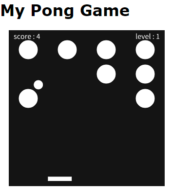

# my_lessons
学習サイトの提供コンテンツをもとに、改版・変更したコンテンツを紹介いたします。

---
## [紹介サイト](https://sgtao.github.io/my_lessons/)：
- 01_dotinstall_Numbers]
  - ドットインストール「[JavaScriptで数字タッチゲームを作ろう](https://dotinstall.com/lessons/numbers_js_v4)」の変更
  
- 02_AosagiHeron_PongGame
  - Youtube「[ヘロンの数学」のピンポンゲーム](https://www.youtube.com/watch?v=rdGKg6VbFBo)を実装してみる
  
- 03_AosagiHeron_minesweeper
  - Youtube「[ヘロンの数学」のマインスィーパー](https://www.youtube.com/watch?v=C-pPqPqhJSM)を実装してみる。
  

